<div align="center">

<!-- HERO ANIMATION -->
<p align="center">
  
</p>

<!-- TYPING + AVATAR SIDE BY SIDE -->
<table align="center"><tr>
<td align="center" width="75%">

</td>
<td align="center" width="25%">

</td>
</tr></table>

<!-- QUICK LINKS — LinkedIn · Portfolio · Gmail · GitHub only -->
<p align="center">
  <a href="https://www.linkedin.com/in/vaishnavi-dwivedi-384773390/" target="_blank">
    
  </a>
  &nbsp;
  <a href="https://vaishnavi5200.github.io/portfolio-website/" target="_blank">
    
  </a>
  &nbsp;
  <a href="mailto:dwivedivaishnavi5200@gmail.com">
    
  </a>
  &nbsp;
  <a href="https://github.com/Vaishnavi5200">
    
  </a>
</p>

<p align="center">
  
</p>

<!-- SNAKE / ACTIVITY ANIMATION above terminal -->
<p align="center">
  
</p>


<!-- ANIMATED TERMINAL -->
<br/>

<br/>


</div>

<br/>

### 🧑‍💻 About Me 


- 🎓 **B.Tech CSE student** & **Full-Stack Developer** turning real ideas into deployed software.
- 🚀 Shipped **CrediFlow**, **CareerOS**, and **EntitlementIQ** from scratch to live production.
- 🏆 **4th Place out of 100 Teams** at HackWithUP 2.0 RocketRide Buildathon ($100 Prize).
- 🧭 Currently exploring AI engineering, backend systems, cloud, and system design.
- ⚡ **Daily mode:** Turn coffee into clean commits &nbsp; &nbsp;

<br clear="right"/>

<div align="center">
  
</div>

<br/>


<h3 align="left">🛠️ Languages &amp; Tools </h3>

<!-- DEVICON SVG ICONS -->
<p align="left">
<a href="https://developer.mozilla.org/en-US/docs/Web/JavaScript" target="_blank" rel="noreferrer"></a>
<a href="https://www.typescriptlang.org/" target="_blank" rel="noreferrer"></a>
<a href="https://reactjs.org/" target="_blank" rel="noreferrer"></a>
<a href="https://nextjs.org/" target="_blank" rel="noreferrer"></a>
<a href="https://nodejs.org" target="_blank" rel="noreferrer"></a>
<a href="https://expressjs.com" target="_blank" rel="noreferrer"></a>
<a href="https://fastapi.tiangolo.com/" target="_blank" rel="noreferrer"></a>
<a href="https://www.python.org" target="_blank" rel="noreferrer"></a>
<a href="https://www.w3.org/html/" target="_blank" rel="noreferrer"></a>
<a href="https://www.w3schools.com/css/" target="_blank" rel="noreferrer"></a>
<a href="https://tailwindcss.com/" target="_blank" rel="noreferrer"></a>
<a href="https://www.mongodb.com/" target="_blank" rel="noreferrer"></a>
<a href="https://www.mysql.com/" target="_blank" rel="noreferrer"></a>
<a href="https://www.docker.com/" target="_blank" rel="noreferrer"></a>
<a href="https://git-scm.com/" target="_blank" rel="noreferrer"></a>
<a href="https://github.com/" target="_blank" rel="noreferrer"></a>
<a href="https://www.java.com" target="_blank" rel="noreferrer"></a>
<a href="https://www.cprogramming.com/" target="_blank" rel="noreferrer"></a>
<a href="https://www.postman.com/" target="_blank" rel="noreferrer"></a>
<a href="https://vercel.com/" target="_blank" rel="noreferrer"></a>
</p>

<!-- TECH MATRIX -->
<table>
<tr>
<td width="50%" valign="top">

**💻 Languages:** `C` • `Java` • `Python` • `JavaScript` • `TypeScript`

**🎨 Frontend:** `React.js` • `Next.js` • `HTML5` • `CSS3` • `Tailwind CSS`

**⚙️ Backend:** `Node.js` • `Express.js` • `FastAPI` • `REST APIs`

</td>
<td width="50%" valign="top">

**🗄️ Databases:** `MongoDB` • `MySQL`

**🚀 Deployment:** `Git` • `GitHub` • `Docker` • `Vercel` • `Render` • `Railway`

**📐 Concepts:** `DSA` • `OOP` • `DBMS` • `CRUD` • `Responsive Design`

</td>
</tr>
</table>

<br clear="right"/>

<div align="center">
  
</div>

<br/>

### 🧠 Currently Exploring: AI Engineering


> *Active exploration & learning path — ongoing study, not commercial production expertise:*

```
┌─────────────────┐     ┌──────────────┐     ┌───────────────────┐     ┌──────────────────────┐
│ LLMs & Prompting│ ──► │ RAG & Vectors│ ──► │ AI Agents & Tools │ ──► │ Backend Integration  │
└─────────────────┘     └──────────────┘     └───────────────────┘     └──────────────────────┘
```

<table>
<tr>
<td width="33%" valign="top">
<h4>🤖 AI Engineering</h4>
<p>
<code>LLM Basics</code> • <code>Prompt Eng</code><br/>
<code>RAG</code> • <code>Vector DBs</code><br/>
<code>AI Agents</code> • <code>Tool Calling</code><br/>
<code>LangChain</code> • <code>LangGraph</code><br/>
<code>Model APIs</code> • <code>AI Eval</code>
</p>
</td>
<td width="33%" valign="top">
<h4>☁️ Cloud & DevOps</h4>
<p>
<code>Docker</code><br/>
<code>CI/CD Pipelines</code><br/>
<code>AWS Basics</code><br/>
<code>GCP Basics</code>
</p>
</td>
<td width="33%" valign="top">
<h4>📐 System Design</h4>
<p>
<code>REST API Architecture</code><br/>
<code>Caching Strategies</code><br/>
<code>Database Design</code><br/>
<code>Scalability Concepts</code>
</p>
</td>
</tr>
</table>

<br clear="right"/>

<div align="center">
  
</div>

<br/>

## 🚀 Featured Projects 

<table>
<tr>
<td width="100%" valign="top">
<h3>🔎 <a href="https://github.com/Vaishnavi5200/CrediFlow">CrediFlow</a></h3>
<p><strong>Autonomous GST ITC compliance & reconciliation platform</strong></p>
<p>
<code>Purchase Register + GSTR-2B</code> ➔ <code>Deterministic MOD-36 Match</code> ➔ <code>Multi-Agent AI Verification</code> ➔ <code>Human-in-the-Loop Risk Gate</code>
</p>
<p>Reconciles purchase registers against GSTR-2B streams using reproducible mathematical logic, coordinates a RocketRide dual-agent AI verification pipeline, and gates high-risk exposures for human review.</p>
<p>


</p>
<p>🏆 <strong>HackWithUP 2.0 RocketRide Buildathon · 4th Place out of 100 Teams ($100 Prize)</strong> · <em>Led Team Nirmaan</em></p>
<p>
<a href="https://credi-flow-gray.vercel.app/" target="_blank"></a>
&nbsp;
<a href="https://github.com/Vaishnavi5200/CrediFlow" target="_blank"></a>
</p>
</td>
</tr>
<tr>
<td width="100%" valign="top">
<h3>💼 <a href="https://github.com/Vaishnavi5200/Placementtrack-pro">CareerOS</a></h3>
<p><strong>Full-stack career & placement preparation workspace</strong></p>
<p>
<code>Job Application Tracking</code> ➔ <code>Interview Stage Timeline</code> ➔ <code>Follow-up Reminders</code> ➔ <code>Daily DSA Habit Engine</code>
</p>
<p>Centralizes job application lifecycles, interview stages, follow-up alerts, and daily DSA practice tracking with custom streak-calculation algorithms, controller-level data isolation, and stateful JWT authentication.</p>
<p>


</p>
<p>
<a href="https://placementtrack-pro.vercel.app/" target="_blank"></a>
&nbsp;
<a href="https://github.com/Vaishnavi5200/Placementtrack-pro" target="_blank"></a>
</p>
</td>
</tr>
<tr>
<td width="100%" valign="top">
<h3>🧠 <a href="https://github.com/Vaishnavi5200/entitlement_iq">EntitlementIQ</a></h3>
<p><strong>Construction claims intelligence & entitlement engine</strong></p>
<p>
<code>Site Logs & Weather Records</code> ➔ <code>FIDIC Contract Parsing</code> ➔ <code>28-Day Deadline Forensics</code> ➔ <code>Draft Claim Notices</code>
</p>
<p align="center">

</p>
<p>Analyzes site logs and weather metrics against FIDIC contract clauses, tracks the 28-day statutory notice clock, and drafts audit-ready claim notices without arithmetic hallucination.</p>
<p>


</p>
<p>
<a href="https://entitlementiq.vercel.app/" target="_blank"></a>
&nbsp;
<a href="https://github.com/Vaishnavi5200/entitlement_iq" target="_blank"></a>
</p>
</td>
</tr>
</table>

<div align="center">
  
</div>

<br/>

### 📊 GitHub Activity

<div align="center">
  
  &nbsp;&nbsp;
  
</div>

<br/>

<p align="center">
  
</p>

<div align="center">
  
</div>

<br/>

### 🤝 Let's Connect 🤪

<table>
<tr>
<td valign="middle" width="72%">
<p>
<em>Open to collaborations, internships & exciting projects!</em> 😁<br/>
<em>Let's build something great together</em> 😘
</p>
<p>
<a href="https://www.linkedin.com/in/vaishnavi-dwivedi-384773390/" target="_blank">

</a>
&nbsp;
<a href="https://vaishnavi5200.github.io/portfolio-website/" target="_blank">

</a>
&nbsp;
<a href="mailto:dwivedivaishnavi5200@gmail.com">

</a>
&nbsp;
<a href="https://github.com/Vaishnavi5200">

</a>
</p>
</td>
<td valign="middle" width="28%" align="center">

</td>
</tr>
</table>

<!-- FOOTER WAVE -->
<p align="center">
  
</p>
